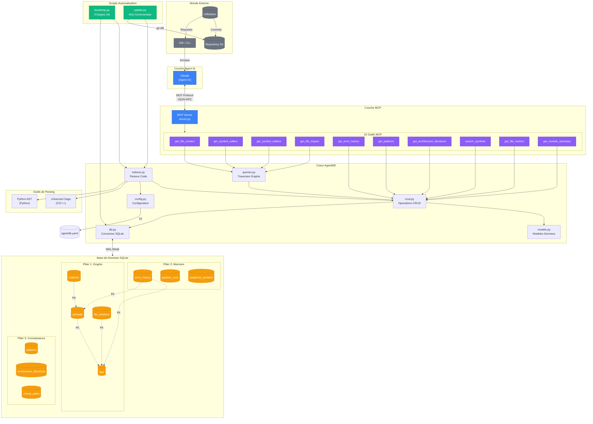
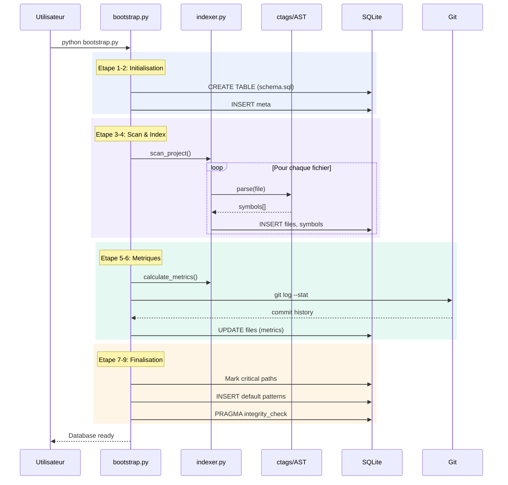
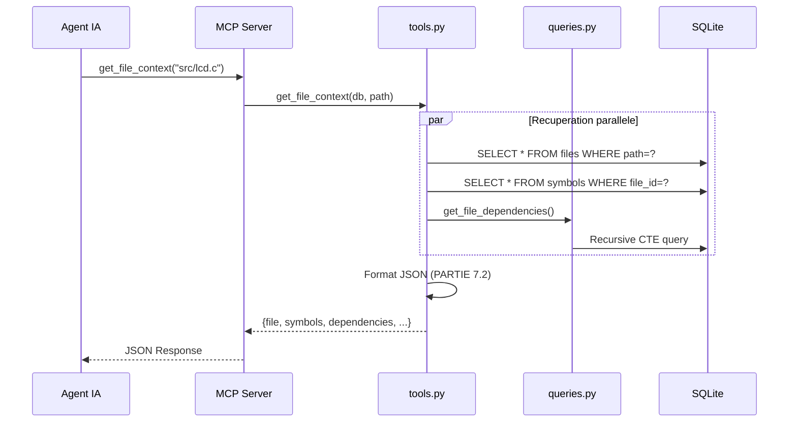
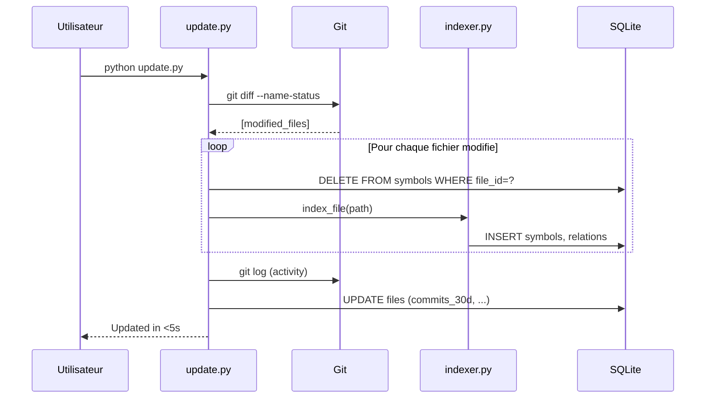
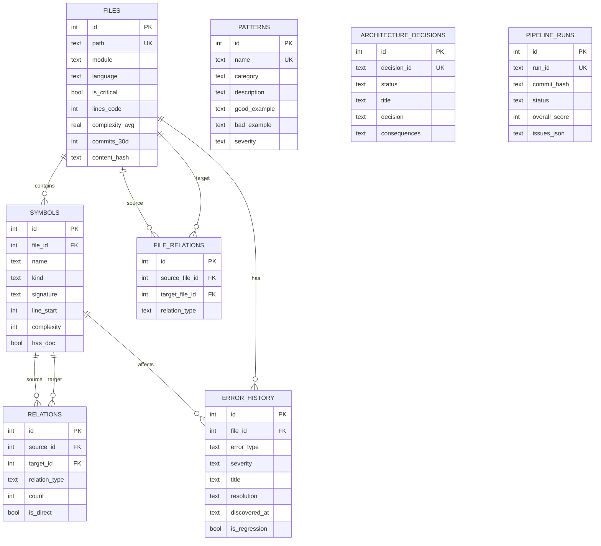
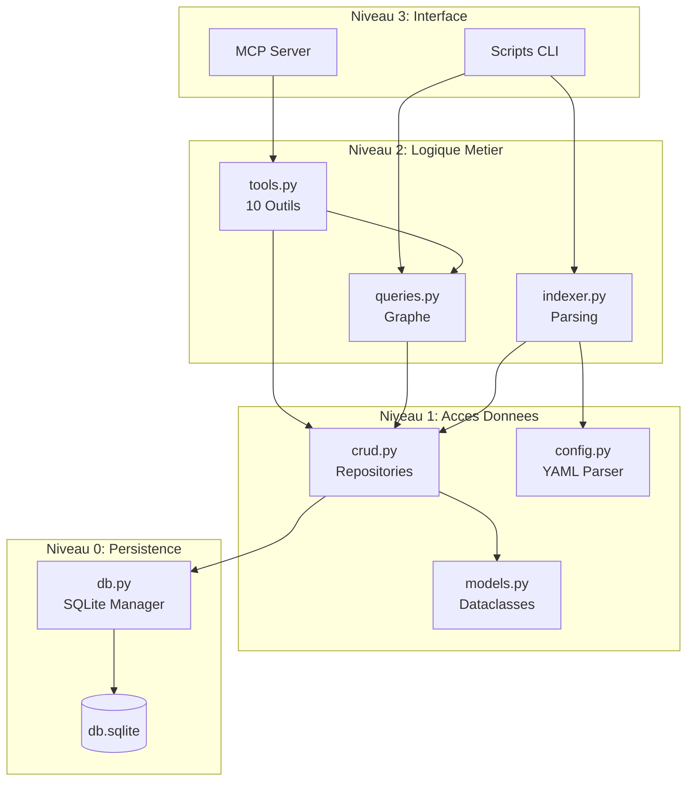
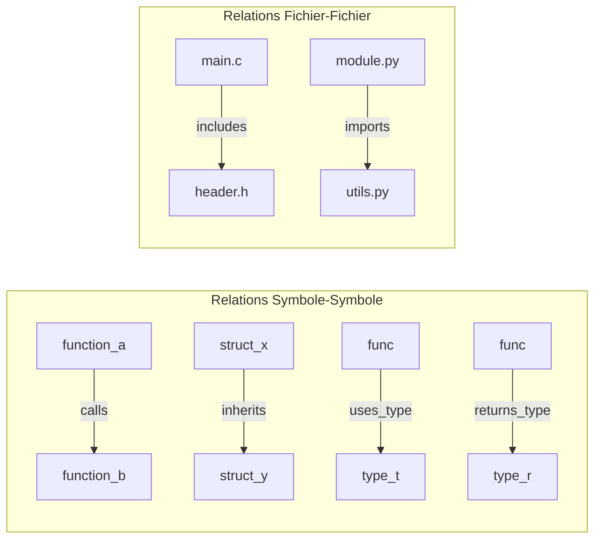

# Architecture Globale

> Visualisation complete du systeme AgentDB et de ses flux de donnees

---

## Diagramme d'Architecture Principal



---

## Flux de Donnees Detaille

### Flux 1 : Bootstrap Initial



---

### Flux 2 : Requete MCP



---

### Flux 3 : Mise a Jour Incrementale



---

## Schema de la Base de Donnees



---

## Hierarchie des Composants



---

## Types de Relations du Graphe



**Types de relations supportes** :

| Categorie | Types |
|-----------|-------|
| Appels | `calls`, `uses_variable`, `modifies`, `reads` |
| Inclusion | `includes`, `imports` |
| Types | `uses_type`, `returns_type`, `has_param_type` |
| Heritage | `inherits`, `implements` |
| Structure | `contains`, `defines`, `declares` |
| Autres | `instantiates`, `uses_macro`, `references` |

---

## Caracteristiques de Performance

| Operation | Temps Cible | Strategie |
|-----------|-------------|-----------|
| Bootstrap petit projet (100 fichiers) | ~10s | Indexation parallele |
| Bootstrap moyen (1000 fichiers) | ~2min | Batch inserts |
| Mise a jour incrementale | <5s | Delta detection |
| Requete simple | <10ms | Index SQL |
| Traversee graphe (depth 3) | 50-200ms | CTE recursives |
| Analyse d'impact complete | 100-500ms | Cache + index |

---

## Configuration SQLite Optimisee

```sql
PRAGMA foreign_keys = ON;      -- Integrite referentielle
PRAGMA journal_mode = WAL;     -- Write-Ahead Logging
PRAGMA synchronous = NORMAL;   -- Performance vs durabilite
PRAGMA cache_size = -64000;    -- 64MB cache
PRAGMA temp_store = MEMORY;    -- Temp tables en RAM
```

---

## Prochaine Etape

Continuez vers [03-analyse-configuration.md](./03-analyse-configuration.md) pour une dissection complete des fichiers de configuration.
