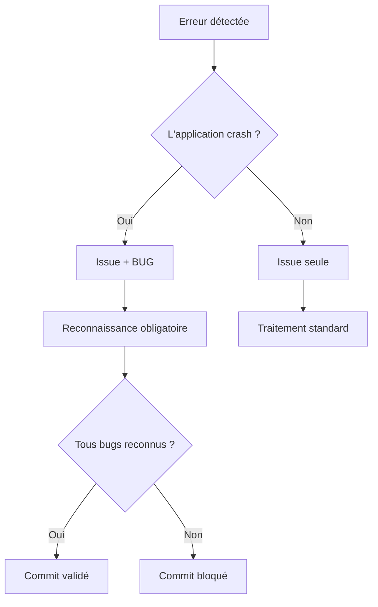

# Étiquette BUG

L'étiquette **BUG** est une classification spéciale qui s'ajoute à une issue existante pour indiquer qu'elle provoque un arrêt brutal de l'application.

## Définition

!!! abstract "Définition officielle"
    Un **BUG** désigne un défaut de code qui provoque un **arrêt brutal ou un blocage de l'application** pour l'utilisateur final :

    - Crash
    - Gel (freeze)
    - Fermeture inopinée
    - Application figée

    Cette étiquette ne concerne **que** les défauts rendant l'application **totalement inutilisable**.

## Ce qui n'est PAS un BUG

Un code qui présente les problèmes suivants mais qui **reste fonctionnel** pour l'utilisateur n'est **pas** un BUG :

| Problème | Conséquence | BUG ? |
|----------|-------------|:-----:|
| Résultats incorrects | Affichage erroné | :x: Non |
| Données corrompues | Valeurs fausses | :x: Non |
| Vulnérabilité de sécurité | Risque d'attaque | :x: Non |
| Problème de performance | Lenteur | :x: Non |
| Fuite mémoire | Consommation excessive | :x: Non |

Ces problèmes sont des **issues** classées dans leurs catégories respectives (Security, Reliability, Maintainability) mais ne portent pas l'étiquette BUG.

## Principe fondamental

!!! tip "Règle clé"
    **La même erreur de code peut être un BUG ou non selon son contexte d'utilisation.**

    L'étiquette BUG n'est pas déterminée par le type d'erreur, mais par ses **conséquences** sur l'exécution du programme.

## Exemple détaillé

Prenons un cas classique : l'absence de vérification du retour d'une fonction.

### Le code problématique

Les deux fonctions suivantes ont la **même erreur** : elles ne vérifient pas le retour de `read()`.

=== "Fonction avec BUG"

    ```c title="display_file_bug.c" linenums="1"
    void display_file_bug()
    {
        int fd = open("filename", O_RDONLY);
        // Pas de vérification du retour

        char *buffer = malloc(1024);
        ssize_t n = read(fd, buffer, 1024);
        // Pas de vérification du retour

        char output[100];
        memcpy(output, buffer, n); // Utilisation de la donnée non valide -> Conduit à un crash

        printf("Copié %zd octets\n", n);
        free(buffer);
    }
    ```

    1. :material-bug: **CRASH** si `n` est négatif ! Ce cas d'utilisation de `memcpy` avec une taille négative provoque un arrêt brutal de l'application (segmentation fault).

=== "Fonction sans BUG"

    ```c title="display_file_no_bug.c" linenums="1"
    void display_file_no_bug()
    {
        int fd = open("filename", O_RDONLY);
        // Pas de vérification du retour

        char *buffer = malloc(1024);
        ssize_t n = read(fd, buffer, 1024);
        // Pas de vérification du retour

        printf("Contenu: %s\n", buffer); // Utilisation de la donnée non valide -> Pas de crash, mais affichage incorrect
        printf("Octets lus: %zd\n", n);

        free(buffer);
    }
    ```

    1. Pas de crash. Affichage incorrect (buffer non initialisé, `n` négatif) mais l'application continue.

### Analyse comparative

Les deux fonctions génèrent la **même issue** :

| Champ | Valeur |
|-------|--------|
| **Catégorie** | Reliability |
| **Sévérité** | Major |
| **Titre** | Missing error handling on read() return value |
| **Fichier** | `display_file.c` |

**Mais** :

| Fonction | Étiquette BUG | Raison |
|----------|:-------------:|--------|
| `display_file_bug` | :material-check: **OUI** | `memcpy` avec taille négative → crash |
| `display_file_no_bug` | :x: Non | Affichage incorrect mais pas de crash |

### Pourquoi cette distinction ?



## Impact sur le workflow

### Affichage dans l'interface

Une issue avec l'étiquette BUG s'affiche avec un badge supplémentaire violet :

```
┌─────────────────────────────────────────────────────────────┐
│ 🛡️  Major   Reliability   BUG                              │
│                                                             │
│ Missing error handling on read() return value               │
│ src/file_handler.c:42                                       │
│                                                             │
│ ┌─────────────────────────────────────────────────────────┐ │
│ │ ☐ J'ai pris en compte ce bug                            │ │
│ └─────────────────────────────────────────────────────────┘ │
└─────────────────────────────────────────────────────────────┘
```

### Reconnaissance obligatoire

!!! warning "Règle métier"
    Un commit ne peut être marqué comme **success** que si **tous les bugs sont reconnus**.

La reconnaissance se fait via une checkbox qui apparaît uniquement pour les issues ayant l'étiquette BUG.

[:octicons-arrow-right-24: Guide de reconnaissance des bugs](../user-guide/bug-acknowledgement.md)

## Résumé

| Aspect | Issue standard | Issue + BUG |
|--------|----------------|-------------|
| Catégorie | ✓ | ✓ |
| Sévérité | ✓ | ✓ |
| Statut | ✓ | ✓ |
| Couleur badge | Gris | Violet |
| Reconnaissance | Non requise | **Obligatoire** |
| Impact commit | Aucun | Bloque si non reconnu |

## Voir aussi

- [Système d'issues](issues.md) - Classification complète des issues
- [Guide : Reconnaissance des bugs](../user-guide/bug-acknowledgement.md) - Procédure de reconnaissance
