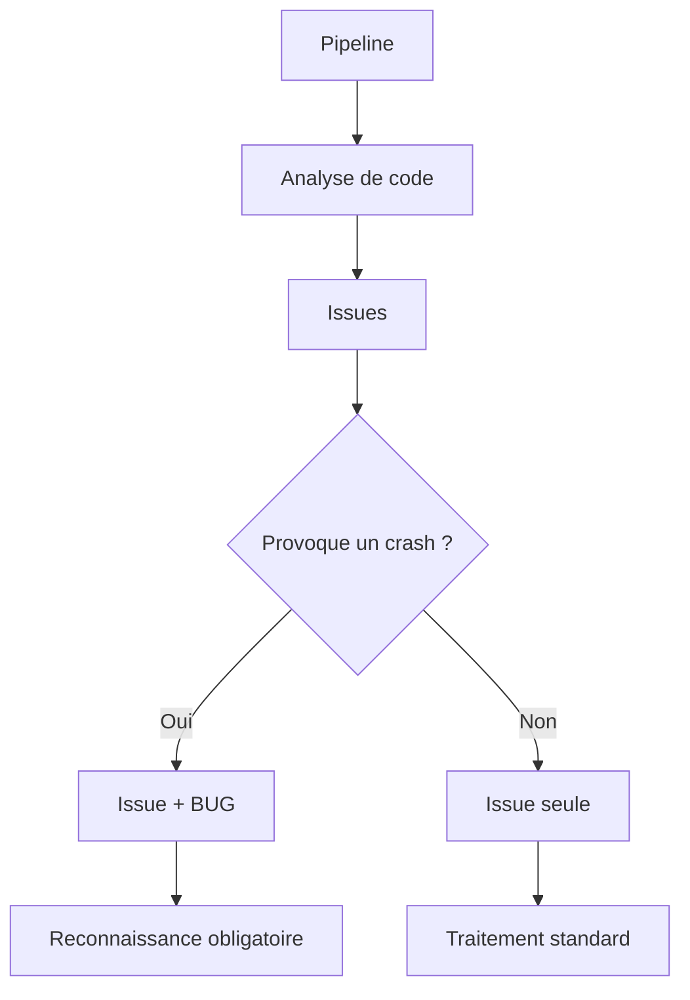
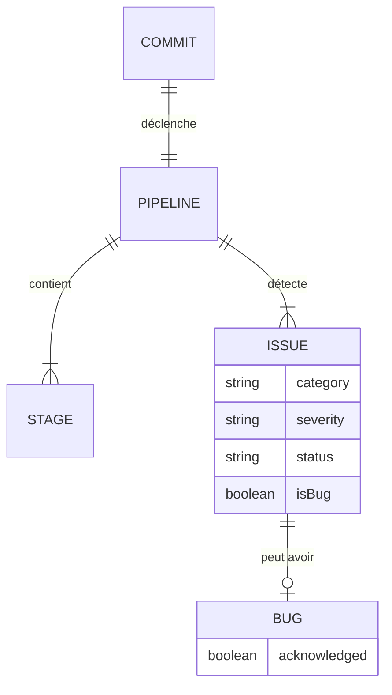

# Concepts fondamentaux

Cette section présente les concepts clés du système CRE Interface.

## Vue d'ensemble

Le système repose sur trois piliers :

## Les trois concepts

### 1. Le système d'issues

Les **issues** sont les problèmes de qualité détectés dans le code. Chaque issue possède :

- Une **catégorie** : Security, Reliability, ou Maintainability
- Une **sévérité** : de Info (faible) à Blocker (critique)
- Un **statut** : pending, in-progress, ou done

[:octicons-arrow-right-24: En savoir plus sur les issues](issues.md)

### 2. L'étiquette BUG

Le **BUG** est une étiquette supplémentaire qui s'ajoute à une issue existante. Elle indique que le problème détecté provoque un **arrêt brutal** de l'application.

!!! warning "Distinction importante"
    Le BUG n'est pas une catégorie. C'est une étiquette qui complète la classification existante.

    Exemple : Une issue peut être `Major | Reliability | Missing error handling` et avoir **en plus** l'étiquette BUG si ce manque de gestion d'erreur provoque un crash.

[:octicons-arrow-right-24: Comprendre l'étiquette BUG](bug-definition.md)

### 3. La pipeline

La **pipeline** est le processus automatisé qui s'exécute à chaque commit. Elle compile le code et analyse sa qualité.

[:octicons-arrow-right-24: Fonctionnement de la pipeline](pipeline.md)

## Relation entre les concepts

Le statut final d'un commit dépend de :

1. Le succès de la pipeline
2. La reconnaissance de tous les bugs détectés
