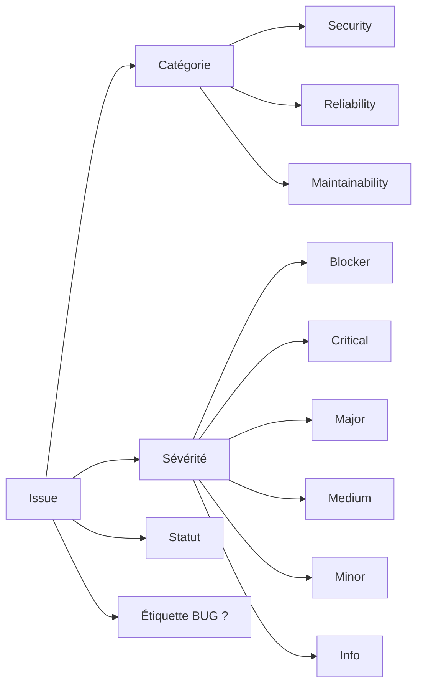
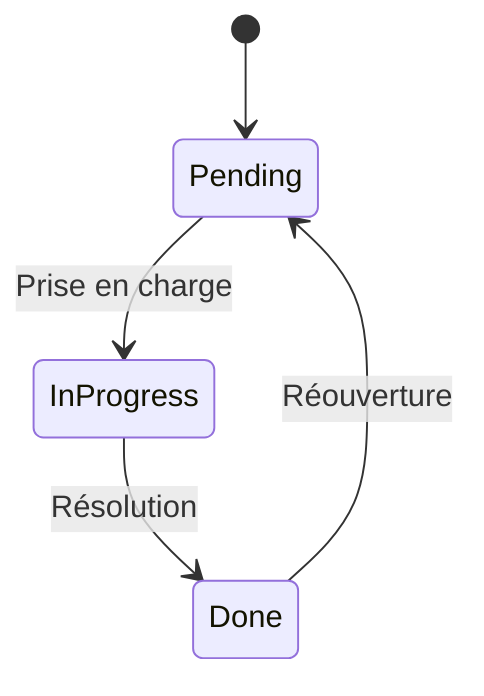

# Système d'issues

Une **issue** représente un problème de qualité de code détecté par l'analyseur. Chaque issue est caractérisée par sa catégorie, sa sévérité, et peut porter l'étiquette BUG.

## Structure d'une issue



## Catégories

Les issues sont classées en trois catégories selon la nature du problème :

### :material-shield: Security (Sécurité)

Problèmes pouvant compromettre la sécurité de l'application ou des données.

| Exemples | Impact |
|----------|--------|
| Injection SQL | Accès non autorisé aux données |
| Credentials en dur | Fuite d'informations sensibles |
| XSS (Cross-Site Scripting) | Exécution de code malveillant |
| Contournement d'authentification | Accès non autorisé |

### :material-alert: Reliability (Fiabilité)

Problèmes affectant la stabilité et le bon fonctionnement de l'application.

| Exemples | Impact |
|----------|--------|
| Gestion d'erreurs manquante | Comportement imprévisible |
| Ressources non libérées | Fuites mémoire |
| Conditions de course | Résultats incohérents |
| Déréférencement null | Crash potentiel |

### :material-wrench: Maintainability (Maintenabilité)

Problèmes rendant le code difficile à comprendre, modifier ou faire évoluer.

| Exemples | Impact |
|----------|--------|
| Code dupliqué | Maintenance coûteuse |
| Complexité excessive | Risque d'erreurs |
| Variables inutilisées | Code mort |
| Nommage peu clair | Compréhension difficile |

## Sévérités

La sévérité indique la gravité du problème :

| Niveau | Couleur | Description | Action requise |
|--------|---------|-------------|----------------|
| **Blocker** | :red_square: Rouge foncé | Bloque le déploiement | Correction immédiate |
| **Critical** | :red_square: Rouge | Très grave | Correction urgente |
| **Major** | :orange_square: Orange | Impact significatif | Correction planifiée |
| **Medium** | :yellow_square: Jaune | Impact modéré | À traiter |
| **Minor** | :blue_square: Bleu | Impact faible | Peut être repoussé |
| **Info** | :white_large_square: Gris | Information | Optionnel |

## Tableau croisé

Les issues sont présentées dans un tableau croisant catégories et sévérités :

|                     | Blocker | Critical | Major | Medium | Minor | Info |
|---------------------|:-------:|:--------:|:-----:|:------:|:-----:|:----:|
| **Security**        |    2    |    1     |   0   |   0    |   0   |  0   |
| **Reliability**     |    0    |    0     |   1   |   1    |   0   |  0   |
| **Maintainability** |    0    |    0     |   0   |   1    |   2   |  1   |

Ce tableau permet d'avoir une vue d'ensemble rapide de la qualité du code.

## Statut des issues

Chaque issue possède un statut de traitement :



| Statut | Icône | Description |
|--------|-------|-------------|
| `pending` | :material-circle-outline: | Non traité |
| `in-progress` | :material-clock-outline: | En cours de traitement |
| `done` | :material-check-circle: | Résolu |

## Étiquette BUG

!!! warning "Important"
    L'étiquette **BUG** n'est pas une catégorie ni une sévérité. C'est une information supplémentaire indiquant que l'issue provoque un **crash de l'application**.

Une issue avec l'étiquette BUG :

- Conserve sa catégorie (Security, Reliability, Maintainability)
- Conserve sa sévérité (Blocker, Critical, etc.)
- Nécessite une **reconnaissance explicite** avant que le commit soit validé

[:octicons-arrow-right-24: Comprendre l'étiquette BUG](bug-definition.md)

## Exemple concret

Considérons ce code avec une gestion d'erreurs manquante :

```c
ssize_t n = read(fd, buffer, 1024);
// Pas de vérification du retour de read()
```

Cette même erreur génère une issue :

| Champ | Valeur |
|-------|--------|
| Catégorie | Reliability |
| Sévérité | Major |
| Titre | Missing error handling |

Mais l'étiquette **BUG** dépend du contexte d'utilisation :

=== "Avec BUG"
    ```c
    ssize_t n = read(fd, buffer, 1024);
    memcpy(output, buffer, n);  // Crash si n < 0
    ```

    :material-bug: **BUG** car `memcpy` avec une taille négative provoque un crash.

=== "Sans BUG"
    ```c
    ssize_t n = read(fd, buffer, 1024);
    printf("Lu: %zd octets\n", n);  // Pas de crash
    ```

    Pas de BUG car l'application reste fonctionnelle (affichage incorrect mais pas de crash).
