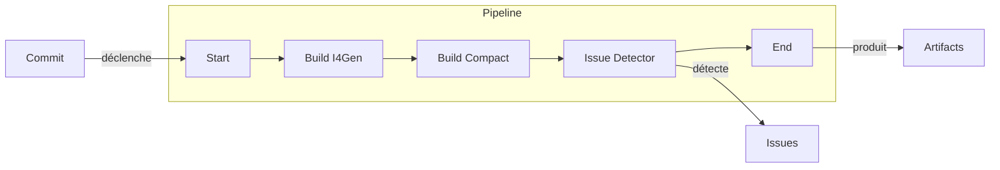
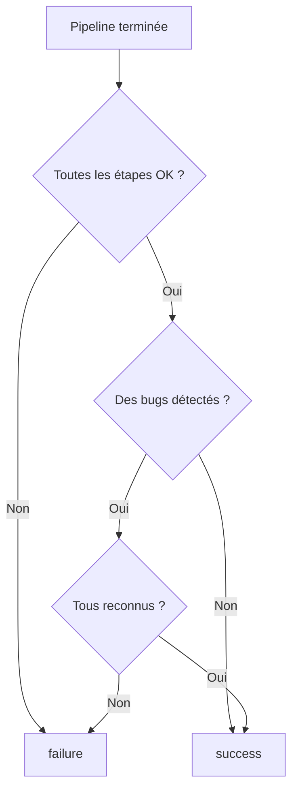
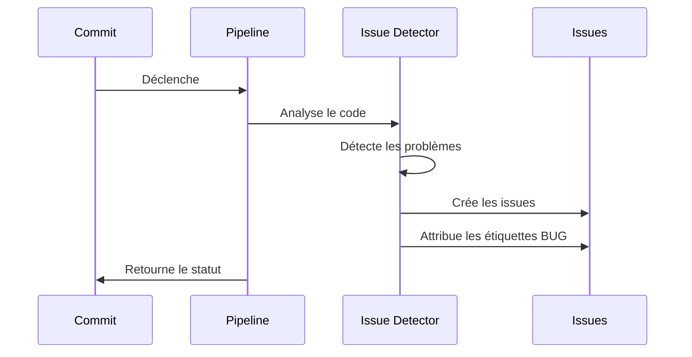

# Pipeline

La **pipeline** est le processus automatisé qui s'exécute à chaque commit pour compiler le code et analyser sa qualité.

## Vue d'ensemble



## Étapes de la pipeline

Chaque pipeline est composée de **3 étapes** exécutées séquentiellement :

### 1. Build I4Gen

| Propriété | Valeur |
|-----------|--------|
| **Objectif** | Compilation principale du projet |
| **Entrée** | Code source |
| **Sortie** | Artefact compilé |

Actions réalisées :

- Compilation des sources TypeScript
- Résolution des dépendances
- Génération du bundle principal

### 2. Build Compact

| Propriété | Valeur |
|-----------|--------|
| **Objectif** | Optimisation de l'artefact |
| **Entrée** | Artefact de Build I4Gen |
| **Sortie** | Artefact optimisé |

Actions réalisées :

- Minification du code
- Tree shaking (suppression du code mort)
- Compression des assets

### 3. Issue Detector

| Propriété | Valeur |
|-----------|--------|
| **Objectif** | Analyse de qualité du code |
| **Entrée** | Code source |
| **Sortie** | Liste des issues détectées |

Actions réalisées :

- Analyse statique du code
- Détection des vulnérabilités (Security)
- Détection des problèmes de fiabilité (Reliability)
- Détection des problèmes de maintenabilité (Maintainability)
- Attribution de l'étiquette BUG si applicable

## Statuts de la pipeline

Chaque étape peut avoir l'un des statuts suivants :

| Statut | Icône | Description |
|--------|-------|-------------|
| `success` | :material-check-circle:{ .green } | Étape réussie |
| `failure` | :material-close-circle:{ .red } | Étape échouée |
| `running` | :material-loading: | Étape en cours |

## Statut global du commit

Le statut final d'un commit dépend de deux facteurs :



!!! info "Règle importante"
    Un commit n'est marqué **success** que si :

    1. Toutes les étapes de la pipeline sont en succès
    2. **ET** tous les bugs détectés sont reconnus

## Artifacts

À l'issue de la pipeline, des **artifacts** (artefacts) sont produits :

| Type | Extension | Description |
|------|-----------|-------------|
| JAR | `.jar` | Archive Java exécutable |
| LOG | `.txt` | Logs de build |
| XML | `.xml` | Rapports de tests |

Exemple d'artifacts produits :

```
📦 application.jar     45.2 MB
📄 build-logs.txt      128 KB
📄 test-results.xml    89 KB
```

## Visualisation

L'interface permet de visualiser la pipeline de manière interactive :

1. **Cliquer sur une étape** pour voir ses détails
2. **Consulter la sortie** au format Markdown
3. **Voir le statut** de chaque étape (succès/échec)

La sortie de chaque étape inclut :

- Configuration utilisée
- Étapes exécutées
- Résultat final
- Code de sortie

[:octicons-arrow-right-24: Guide : Visualiser la pipeline](../user-guide/navigation.md#visualiser-la-pipeline)

## Relation avec les issues

L'étape **Issue Detector** est responsable de :

1. Analyser le code source
2. Détecter les problèmes
3. Classifier chaque issue (catégorie + sévérité)
4. Déterminer si l'issue provoque un crash (étiquette BUG)



## Voir aussi

- [Système d'issues](issues.md) - Classification des issues
- [Étiquette BUG](bug-definition.md) - Définition des bugs
- [Guide : Navigation](../user-guide/navigation.md) - Utiliser l'interface
