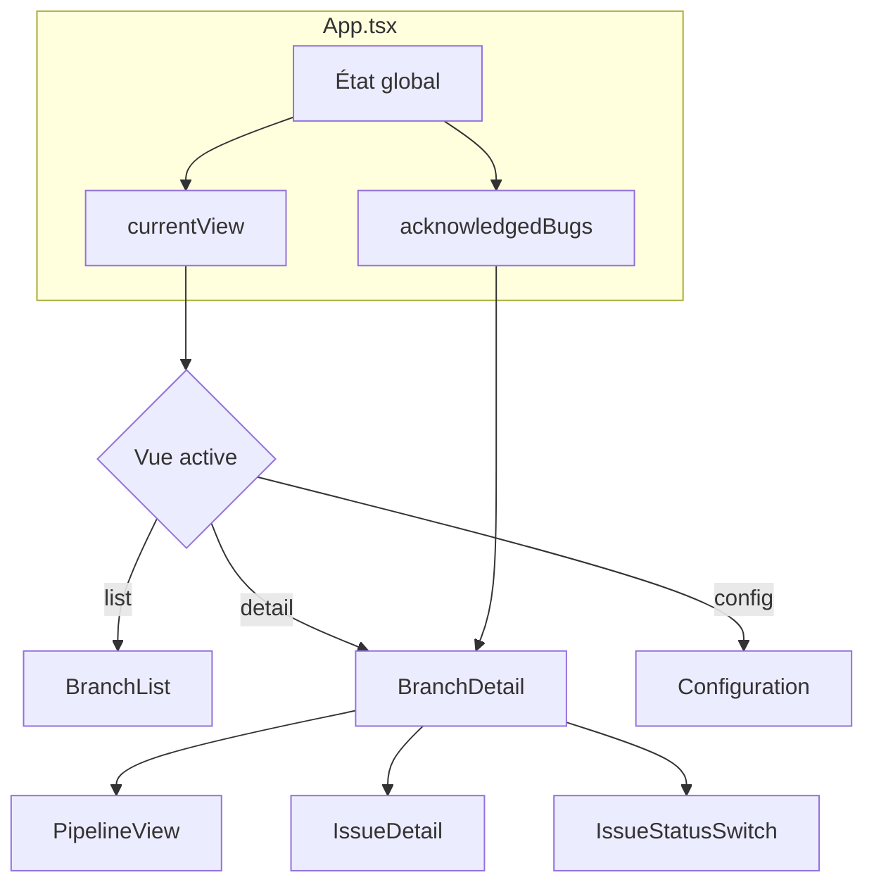

# Architecture technique

Cette section décrit l'architecture technique de CRE Interface.

## Stack technologique

| Technologie | Version | Usage |
|-------------|---------|-------|
| React | 18.3.1 | Framework UI |
| TypeScript | - | Typage statique |
| Vite | 6.3.5 | Build tool |
| SWC | - | Compilation rapide |
| Tailwind CSS | 4.x | Styling |
| Radix UI | 1.x | Composants primitifs |

## Structure du projet

```
CRE_INTERFACE/
├── src/
│   ├── App.tsx                 # Point d'entrée, état global
│   ├── main.tsx                # Bootstrap React
│   ├── components/
│   │   ├── BranchList.tsx      # Liste des branches
│   │   ├── BranchDetail.tsx    # Détail d'une branche
│   │   ├── PipelineView.tsx    # Visualisation pipeline
│   │   ├── IssueDetail.tsx     # Détail d'une issue
│   │   ├── IssueStatusSwitch.tsx # Toggle de statut
│   │   ├── Configuration.tsx   # Page de configuration
│   │   ├── ui/                 # Composants UI réutilisables
│   │   └── figma/              # Composants Figma
│   └── styles/
│       └── globals.css         # Variables CSS et thème
├── docs/                       # Documentation MkDocs
├── package.json
├── vite.config.ts
└── mkdocs.yml
```

## Flux de données



## Gestion de l'état

### État global (App.tsx)

L'application utilise `useState` de React pour gérer l'état :

```typescript
// Navigation entre les vues
const [currentView, setCurrentView] = useState<'list' | 'detail' | 'config'>('list');

// Branche sélectionnée
const [selectedBranchId, setSelectedBranchId] = useState<string | null>(null);

// Reconnaissance des bugs
const [acknowledgedBugs, setAcknowledgedBugs] = useState<Record<string, boolean>>({});
```

### État local (BranchDetail.tsx)

Chaque composant gère son propre état local :

```typescript
// Commit sélectionné
const [selectedCommit, setSelectedCommit] = useState<Commit | null>(null);

// Statut des issues
const [issueStatuses, setIssueStatuses] = useState<Record<string, IssueStatus>>({});

// Issue sélectionnée pour affichage détaillé
const [selectedIssueId, setSelectedIssueId] = useState<string | null>(null);
```

## Types et interfaces

### Issue

```typescript
interface Issue {
  id: string;
  title: string;
  category: 'Security' | 'Reliability' | 'Maintainability';
  severity: 'Blocker' | 'Critical' | 'Major' | 'Medium' | 'Minor' | 'Info';
  isBug: boolean;
  file: string;
  line: number;
  status?: IssueStatus;
}

type IssueStatus = 'pending' | 'in-progress' | 'done';
```

!!! info "Propriété `isBug`"
    La propriété `isBug` est un booléen qui indique si l'issue provoque un crash.
    Ce n'est pas une catégorie mais une **étiquette supplémentaire**.

    Voir [Guide utilisateur : Reconnaissance des bugs](../user-guide/bug-acknowledgement.md) pour l'utilisation.

### Commit

```typescript
interface Commit {
  id: string;
  hash: string;
  message: string;
  author: string;
  date: string;
  status: 'success' | 'failure' | 'running';
  issuesCount: number;
  issues: Issue[];
  artifacts: Artifact[];
}
```

### Artifact

```typescript
interface Artifact {
  id: string;
  name: string;
  type: string;
  size: string;
}
```

### Pipeline Node

```typescript
interface PipelineNode {
  id: string;
  name: string;
  status: 'success' | 'failure';
  output: string;
}
```

## Logique métier clé

### Calcul du statut d'un commit

Le statut d'un commit dépend de la reconnaissance des bugs :

```typescript
const getCommitStatus = (commit: Commit): 'success' | 'failure' | 'running' => {
  if (commit.status === 'running') return 'running';

  const bugs = commit.issues.filter(issue => issue.isBug);
  const allBugsAcknowledged = bugs.every(bug => acknowledgedBugs[bug.id]);

  return allBugsAcknowledged && commit.status === 'success' ? 'success' : 'failure';
};
```

### Calcul du résumé des issues

```typescript
const getIssueSummary = (issues: Issue[]) => {
  const categoryCounts = { Security: 0, Reliability: 0, Maintainability: 0 };
  const severityCounts = { Blocker: 0, Critical: 0, Major: 0, Medium: 0, Minor: 0, Info: 0 };
  const crossTable = { /* matrice catégorie x sévérité */ };
  let bugCount = 0;

  issues.forEach(issue => {
    categoryCounts[issue.category]++;
    severityCounts[issue.severity]++;
    crossTable[issue.category][issue.severity]++;
    if (issue.isBug) bugCount++;
  });

  return { categoryCounts, severityCounts, bugCount, crossTable };
};
```

## Configuration Vite

```typescript
// vite.config.ts
export default defineConfig({
  plugins: [react()],
  resolve: {
    alias: {
      '@': path.resolve(__dirname, './src'),
    },
  },
  build: {
    target: 'esnext',
    outDir: 'build',
  },
  server: {
    port: 3000,
    open: true,
  },
});
```

### Alias de chemin

L'alias `@` pointe vers `./src`, permettant des imports propres :

```typescript
import { Button } from '@/components/ui/button';
```

## Thème et styling

### Variables CSS (globals.css)

```css
:root {
  --font-size: 16px;
  --background: #ffffff;
  --foreground: oklch(0.145 0 0);
  --primary: #030213;
  --destructive: #d4183d;
  --radius: 0.625rem;
  /* ... */
}

.dark {
  --background: oklch(0.145 0 0);
  --foreground: oklch(0.985 0 0);
  /* ... */
}
```

### Couleurs des sévérités

| Sévérité | Classe Tailwind |
|----------|-----------------|
| Blocker | `bg-red-600 text-white` |
| Critical | `bg-red-500 text-white` |
| Major | `bg-orange-500 text-white` |
| Medium | `bg-yellow-500 text-white` |
| Minor | `bg-blue-500 text-white` |
| Info | `bg-gray-500 text-white` |

### Couleur BUG

L'étiquette BUG utilise une palette **violette** distincte :

```css
/* Badge */
bg-purple-100 text-purple-700

/* Checkbox */
text-purple-600 border-purple-300 focus:ring-purple-500

/* Background */
bg-purple-50 border-purple-200
```

## Voir aussi

- [Composants](components.md) - Description détaillée des composants
- [Référence](reference.md) - Tableaux de référence
