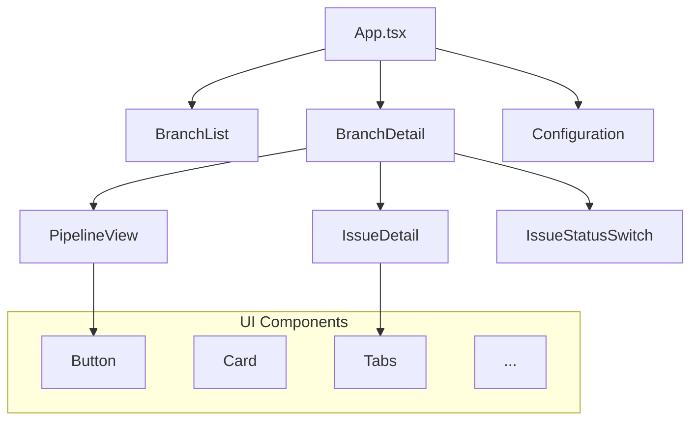

# Composants

Cette section décrit les composants React de l'application.

## Vue d'ensemble



## Composants principaux

### App.tsx

**Fichier** : `src/App.tsx`

Point d'entrée de l'application. Gère :

- La navigation entre les vues (list, detail, config)
- L'état global de reconnaissance des bugs
- Les données mock

**Props** : Aucune (composant racine)

**État** :

| Variable | Type | Description |
|----------|------|-------------|
| `currentView` | `'list' \| 'detail' \| 'config'` | Vue active |
| `selectedBranchId` | `string \| null` | Branche sélectionnée |
| `acknowledgedBugs` | `Record<string, boolean>` | Bugs reconnus |

---

### BranchList

**Fichier** : `src/components/BranchList.tsx`

Affiche la liste des branches du projet.

**Props** :

| Prop | Type | Description |
|------|------|-------------|
| `onSelectBranch` | `(id: string) => void` | Callback de sélection |
| `getCommitStatus` | `(commit: Commit) => Status` | Calcul du statut |

**Fonctionnalités** :

- Liste des branches avec statut agrégé
- Nombre de commits par branche
- Date du dernier push
- Navigation vers le détail

---

### BranchDetail

**Fichier** : `src/components/BranchDetail.tsx`

Affiche le détail d'une branche sélectionnée.

**Props** :

| Prop | Type | Description |
|------|------|-------------|
| `branchId` | `string` | ID de la branche |
| `onBack` | `() => void` | Retour à la liste |
| `acknowledgedBugs` | `Record<string, boolean>` | État des bugs |
| `onBugAcknowledgement` | `(id: string, ack: boolean) => void` | Callback reconnaissance |
| `getCommitStatus` | `(commit: Commit) => Status` | Calcul du statut |

**État local** :

| Variable | Type | Description |
|----------|------|-------------|
| `selectedCommit` | `Commit \| null` | Commit sélectionné |
| `issueStatuses` | `Record<string, IssueStatus>` | Statuts des issues |
| `selectedIssueId` | `string \| null` | Issue ouverte |
| `showPipeline` | `boolean` | Affichage pipeline |

**Fonctions clés** :

```typescript
// Résumé des issues avec tableau croisé
const getIssueSummary = (issues: Issue[]) => { ... }

// Statut de reconnaissance des bugs
const getBugAcknowledgementStatus = (issues: Issue[]) => { ... }

// Changement de statut d'une issue
const handleStatusChange = (issueId: string, newStatus: IssueStatus) => { ... }
```

---

### PipelineView

**Fichier** : `src/components/PipelineView.tsx`

Visualise la pipeline d'un commit.

**Props** :

| Prop | Type | Description |
|------|------|-------------|
| `commitId` | `string` | ID du commit |

**État local** :

| Variable | Type | Description |
|----------|------|-------------|
| `selectedNodeId` | `string \| null` | Nœud sélectionné |

**Structure de données** :

```typescript
const pipelineOutputs: Record<string, PipelineNode[]> = {
  'c1': [
    { id: 'build-i4gen', name: 'Build I4Gen', status: 'success', output: '...' },
    { id: 'build-compact', name: 'Build Compact', status: 'success', output: '...' },
    { id: 'issue-detector', name: 'Issue Detector', status: 'success', output: '...' }
  ],
  // ...
};
```

**Rendu** :

- Graphe avec nœuds cliquables
- Affichage de la sortie en Markdown
- Coloration syntaxique du code

---

### IssueDetail

**Fichier** : `src/components/IssueDetail.tsx`

Affiche les détails d'une issue avec trois onglets.

**Props** :

| Prop | Type | Description |
|------|------|-------------|
| `issueId` | `string` | ID de l'issue |

**Onglets** :

| Onglet | Contenu |
|--------|---------|
| Where is the issue? | Localisation dans le code |
| Why is this an issue? | Explication du problème |
| How can I fix it? | Solutions proposées |

**Rendu** :

- Markdown avec `react-markdown`
- Coloration syntaxique avec `react-syntax-highlighter`
- Diagrammes Mermaid

---

### IssueStatusSwitch

**Fichier** : `src/components/IssueStatusSwitch.tsx`

Bouton de changement de statut d'une issue.

**Props** :

| Prop | Type | Description |
|------|------|-------------|
| `status` | `IssueStatus` | Statut actuel |
| `onChange` | `(status: IssueStatus) => void` | Callback de changement |

**Cycle de statut** :

```typescript
const getNextStatus = (): IssueStatus => {
  switch (status) {
    case 'pending': return 'in-progress';
    case 'in-progress': return 'done';
    case 'done': return 'pending';
  }
};
```

**Styles par statut** :

| Statut | Icône | Couleur bordure | Couleur fond |
|--------|-------|-----------------|--------------|
| pending | Circle | Gris | Blanc |
| in-progress | Clock | Ambre | Jaune pâle |
| done | CheckCircle2 | Vert | Vert pâle |

---

### Configuration

**Fichier** : `src/components/Configuration.tsx`

Page de configuration de l'application.

**Props** :

| Prop | Type | Description |
|------|------|-------------|
| `onBack` | `() => void` | Retour à la liste |

**Champs** :

- URL du repository
- Sélection des credentials

---

## Composants UI (ui/)

Composants réutilisables basés sur Radix UI et shadcn/ui.

### Button

**Fichier** : `src/components/ui/button.tsx`

Bouton avec variantes.

```typescript
const buttonVariants = cva(
  "inline-flex items-center justify-center ...",
  {
    variants: {
      variant: {
        default: "bg-primary text-primary-foreground",
        destructive: "bg-destructive text-white",
        outline: "border bg-background",
        secondary: "bg-secondary text-secondary-foreground",
        ghost: "hover:bg-accent",
        link: "text-primary underline-offset-4",
      },
      size: {
        default: "h-9 px-4 py-2",
        sm: "h-8 rounded-md px-3",
        lg: "h-10 rounded-md px-6",
        icon: "size-9 rounded-md",
      },
    },
  }
);
```

### Autres composants UI

| Composant | Usage |
|-----------|-------|
| `accordion` | Sections dépliables |
| `alert` | Messages d'alerte |
| `badge` | Badges de statut |
| `card` | Conteneurs |
| `dialog` | Modales |
| `tabs` | Navigation par onglets |
| `tooltip` | Infobulles |
| ... | ... |

## Bonnes pratiques

### Gestion des bugs

Pour afficher correctement un bug, vérifiez la propriété `isBug` :

```tsx
{issue.isBug && (
  <span className="px-2 py-1 bg-purple-100 text-purple-700 rounded text-xs">
    BUG
  </span>
)}
```

Pour la checkbox de reconnaissance :

```tsx
{issue.isBug && (
  <div className="bg-purple-50 border border-purple-200 rounded p-2">
    <input
      type="checkbox"
      checked={acknowledgedBugs[issue.id] || false}
      onChange={(e) => onBugAcknowledgement(issue.id, e.target.checked)}
    />
    <label>J'ai pris en compte ce bug</label>
  </div>
)}
```

### Utilisation des icônes

Les icônes proviennent de `lucide-react` :

```tsx
import { Shield, AlertTriangle, Wrench, CheckCircle2 } from 'lucide-react';

// Par catégorie
<Shield size={16} className="text-red-600" />      // Security
<AlertTriangle size={16} className="text-orange-600" /> // Reliability
<Wrench size={16} className="text-blue-600" />     // Maintainability
```

## Voir aussi

- [Architecture](architecture.md) - Vue d'ensemble technique
- [Référence](reference.md) - Tableaux de référence
