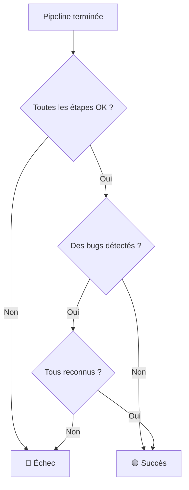

# Reconnaissance des bugs

Ce guide explique comment identifier et reconnaître les bugs dans CRE Interface.

## Qu'est-ce qu'un bug ?

!!! abstract "Rappel"
    Un **BUG** est une étiquette supplémentaire sur une issue indiquant qu'elle provoque un **crash de l'application** (arrêt brutal, gel, fermeture inopinée).

    Ce n'est pas une catégorie à part : une issue avec l'étiquette BUG conserve sa catégorie (Security, Reliability, Maintainability) et sa sévérité.

[:octicons-arrow-right-24: En savoir plus sur la définition d'un bug](../concepts/bug-definition.md)

## Identifier les bugs

Les issues avec l'étiquette BUG se distinguent par :

1. Un **badge violet "BUG"** à côté des autres badges
2. Une **checkbox de reconnaissance** en dessous de l'issue

```
┌─────────────────────────────────────────────────────────────────┐
│ 🛡️  Major   Reliability   BUG                       [○ Pending]│
│                                                                 │
│ Missing error handling on read() return value                   │
│ src/file_handler.c:42                                          │
│                                                                 │
│ ┌─────────────────────────────────────────────────────────┐    │
│ │ ☐ J'ai pris en compte ce bug                            │    │
│ └─────────────────────────────────────────────────────────┘    │
└─────────────────────────────────────────────────────────────────┘
```

## Pourquoi reconnaître les bugs ?

!!! warning "Règle métier importante"
    Un commit ne peut être marqué comme **succès** que si **tous les bugs sont reconnus**.

    Tant qu'un bug n'est pas reconnu, le commit reste en **échec** même si la pipeline s'est bien exécutée.

### Impact sur le statut du commit



## Procédure de reconnaissance

### Étape 1 : Identifier les bugs non reconnus

Le résumé des issues indique si des bugs doivent être reconnus :

```
┌─────────────────────────────────────────────────────────────────┐
│ ℹ️  5 issues détectées. Dont 2 bugs confirmés.                  │
│                                                                 │
│ ⚠️ Attention : 2 bugs doivent être reconnus.                    │
└─────────────────────────────────────────────────────────────────┘
```

### Étape 2 : Consulter le bug

1. Localisez l'issue avec le badge **BUG** violet
2. Cliquez sur l'issue pour voir les détails
3. Consultez les onglets :
   - **Where** : Où se trouve le problème
   - **Why** : Pourquoi c'est un crash
   - **How** : Comment le corriger

### Étape 3 : Reconnaître le bug

!!! note "Que signifie reconnaître un bug ?"
    Reconnaître un bug signifie que vous avez **pris connaissance** du problème et de son impact. Cela ne signifie pas que vous l'avez corrigé.

Cochez la case **"J'ai pris en compte ce bug"** :

```
┌─────────────────────────────────────────────────────────────────┐
│ ☑️ J'ai pris en compte ce bug                                   │
└─────────────────────────────────────────────────────────────────┘
```

### Étape 4 : Vérifier le statut du commit

Une fois tous les bugs reconnus :

- Le message d'alerte disparaît
- Le statut du commit passe à **succès** (si la pipeline était OK)

## Exemple complet

### Situation initiale

```
Commit: a3f2b1c
Status: 🔴 Échec
Issues: 3 (dont 1 bug non reconnu)

┌─────────────────────────────────────────────────────────────────┐
│ ⚠️ Attention : 1 bug doit être reconnu.                         │
└─────────────────────────────────────────────────────────────────┘

Issues:
├─ 🛡️ Major | Security | SQL Injection
├─ ⚠️ Critical | Reliability | BUG | Null pointer dereference  ← Bug non reconnu
└─ 🔧 Minor | Maintainability | Unused variable
```

### Après reconnaissance

```
Commit: a3f2b1c
Status: 🟢 Succès
Issues: 3 (1 bug reconnu)

Issues:
├─ 🛡️ Major | Security | SQL Injection
├─ ⚠️ Critical | Reliability | BUG | Null pointer dereference  ✓ Reconnu
└─ 🔧 Minor | Maintainability | Unused variable
```

## Différence entre reconnaissance et résolution

| Action | Signification | Impact sur le commit |
|--------|---------------|---------------------|
| **Reconnaître** | J'ai vu et compris le bug | Débloque le commit |
| **Résoudre** (statut "Terminé") | J'ai corrigé le code | Aucun impact automatique |

!!! tip "Bonnes pratiques"
    - Reconnaissez rapidement les bugs pour débloquer les commits
    - Changez le statut en "En cours" quand vous travaillez sur la correction
    - Passez en "Terminé" une fois le code corrigé

## Questions fréquentes

### Puis-je annuler une reconnaissance ?

Oui, décochez simplement la case. Le commit repassera en échec.

### Un bug reconnu disparaît-il ?

Non, l'issue reste visible avec son badge BUG. Seule la checkbox est cochée.

### Que se passe-t-il si je corrige le code ?

La correction du code sera détectée lors du prochain commit. L'issue disparaîtra alors automatiquement si le problème est résolu.

### Dois-je reconnaître tous les bugs ?

Oui, pour que le commit soit validé. Mais vous pouvez le faire progressivement tout en consultant les détails de chaque bug.

## Voir aussi

- [Définition d'un bug](../concepts/bug-definition.md) - Comprendre ce qu'est un BUG
- [Gestion des issues](issue-management.md) - Gérer les statuts des issues
- [Pipeline](../concepts/pipeline.md) - Impact sur le statut du commit
