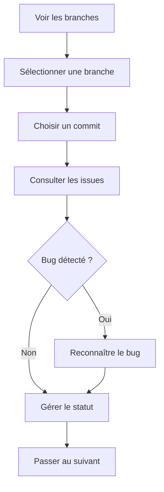

# Guide utilisateur

Bienvenue dans le guide utilisateur de CRE Interface. Ce guide vous accompagne dans l'utilisation quotidienne de l'application.

## Prise en main rapide

### Accéder à l'application

1. Ouvrez votre navigateur
2. Accédez à l'URL de l'application
3. Vous arrivez sur la liste des branches

### Workflow typique



## Sections du guide

### :material-compass: Navigation

Apprenez à naviguer dans l'interface :

- Liste des branches
- Détail d'une branche
- Historique des commits
- Visualisation de la pipeline

[:octicons-arrow-right-24: Guide de navigation](navigation.md)

### :material-format-list-checks: Gestion des issues

Apprenez à gérer les issues détectées :

- Comprendre le tableau de synthèse
- Changer le statut d'une issue
- Consulter les détails d'une issue

[:octicons-arrow-right-24: Gestion des issues](issue-management.md)

### :material-bug: Reconnaissance des bugs

Apprenez à gérer les bugs :

- Identifier les issues avec étiquette BUG
- Procédure de reconnaissance
- Impact sur le statut du commit

[:octicons-arrow-right-24: Reconnaissance des bugs](bug-acknowledgement.md)

## Interface en un coup d'œil

```
┌─────────────────────────────────────────────────────────────────┐
│  Pipeline Multibranches                           [⚙️ Settings] │
├─────────────────────────────────────────────────────────────────┤
│                                                                 │
│  Branches                                                       │
│  ┌─────────────────────────────────────────────────────────┐   │
│  │ 🟢 main         2 commits    Dernière activité: 14:30   │   │
│  │ 🟢 develop      3 commits    Dernière activité: 10:15   │   │
│  │ 🔴 feature/x    1 commit     Dernière activité: 18:45   │   │
│  └─────────────────────────────────────────────────────────┘   │
│                                                                 │
└─────────────────────────────────────────────────────────────────┘
```

## Codes couleur

| Couleur | Signification |
|---------|---------------|
| :green_circle: Vert | Succès, tout est OK |
| :red_circle: Rouge | Échec, attention requise |
| :orange_circle: Orange | En cours d'exécution |
| :purple_circle: Violet | Bug (étiquette spéciale) |

## Conseils

!!! tip "Bonnes pratiques"
    - Consultez régulièrement les issues Blocker et Critical
    - Reconnaissez les bugs dès qu'ils sont identifiés
    - Utilisez le tableau croisé pour une vue d'ensemble rapide

!!! warning "Points d'attention"
    - Un commit reste en échec tant que tous les bugs ne sont pas reconnus
    - Les issues Blocker doivent être traitées en priorité
