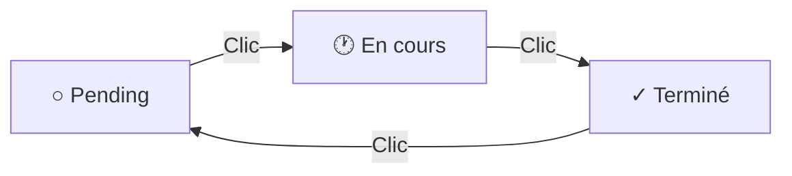

# Gestion des issues

Ce guide explique comment consulter et gérer les issues détectées dans vos commits.

## Accéder aux issues

1. Sélectionnez une branche
2. Cliquez sur un commit
3. La section **Rapport d'analyse du code** s'affiche

## Comprendre le résumé

En haut de la section, un encadré bleu résume les issues détectées :

```
┌─────────────────────────────────────────────────────────────────┐
│ ℹ️  5 issues détectées. Dont 2 bugs confirmés.                  │
│                                                                 │
│ ⚠️ Attention : 1 issue bloquante nécessite une action.         │
│ ⚠️ Attention : 2 bugs doivent être reconnus.                    │
└─────────────────────────────────────────────────────────────────┘
```

### Alertes affichées

| Alerte | Signification |
|--------|---------------|
| `X issues détectées` | Nombre total d'issues |
| `Dont X bugs confirmés` | Issues avec étiquette BUG |
| `X issues bloquantes` | Issues de sévérité Blocker |
| `X bugs doivent être reconnus` | Bugs non encore reconnus |

## Le tableau croisé

Sous le résumé, un tableau croise les catégories et les sévérités :

```
┌───────────────────┬─────────┬──────────┬───────┬────────┬───────┬──────┐
│                   │ Blocker │ Critical │ Major │ Medium │ Minor │ Info │
├───────────────────┼─────────┼──────────┼───────┼────────┼───────┼──────┤
│ 🛡️ Security       │    1    │    0     │   1   │   0    │   0   │  0   │
├───────────────────┼─────────┼──────────┼───────┼────────┼───────┼──────┤
│ ⚠️ Reliability    │    0    │    1     │   0   │   1    │   0   │  0   │
├───────────────────┼─────────┼──────────┼───────┼────────┼───────┼──────┤
│ 🔧 Maintainability│    0    │    0     │   0   │   0    │   1   │  0   │
└───────────────────┴─────────┴──────────┴───────┴────────┴───────┴──────┘
```

### Lecture du tableau

- **Lignes** : Catégories (Security, Reliability, Maintainability)
- **Colonnes** : Sévérités (Blocker → Info)
- **Cellules** : Nombre d'issues pour cette combinaison
- **Couleurs** : Rouge foncé (Blocker) → Gris (Info)

!!! tip "Conseil"
    Concentrez-vous d'abord sur le coin supérieur gauche (Blocker/Critical en Security/Reliability).

## Liste des issues

Sous le tableau, chaque issue est listée individuellement :

```
┌─────────────────────────────────────────────────────────────────┐
│ 🛡️  Blocker   Security   BUG                        [○ Pending]│
│                                                                 │
│ SQL Injection vulnerability in user input                       │
│ src/api/users.ts:42                                            │
│                                                                 │
│ ┌─────────────────────────────────────────────────────────┐    │
│ │ ☐ J'ai pris en compte ce bug                            │    │
│ └─────────────────────────────────────────────────────────┘    │
└─────────────────────────────────────────────────────────────────┘
```

### Éléments affichés

| Élément | Description |
|---------|-------------|
| Icône catégorie | 🛡️ Security / ⚠️ Reliability / 🔧 Maintainability |
| Badge sévérité | Blocker, Critical, Major, Medium, Minor, Info |
| Badge catégorie | Nom de la catégorie |
| Badge BUG | Présent si l'issue provoque un crash |
| Bouton statut | État actuel de l'issue |
| Titre | Description du problème |
| Localisation | Fichier et numéro de ligne |
| Checkbox bug | Présente uniquement si BUG |

## Changer le statut d'une issue

Chaque issue possède un statut que vous pouvez modifier en cliquant sur le bouton de statut.

### Les trois statuts



| Statut | Icône | Couleur | Signification |
|--------|-------|---------|---------------|
| Pending | ○ | Gris | Non traité |
| En cours | 🕐 | Jaune | En cours de traitement |
| Terminé | ✓ | Vert | Résolu |

### Procédure

1. Localisez l'issue dans la liste
2. Cliquez sur le bouton de statut à droite
3. Le statut passe au suivant automatiquement

!!! note "Cycle de statut"
    Le statut suit un cycle : `Pending` → `En cours` → `Terminé` → `Pending`

## Consulter les détails d'une issue

Cliquez sur une issue pour afficher ses détails. Trois onglets sont disponibles :

### Onglet "Where is the issue?"

Montre où se trouve le problème dans le code :

- Extrait de code avec coloration syntaxique
- Ligne problématique mise en évidence
- Contexte environnant

### Onglet "Why is this an issue?"

Explique pourquoi c'est un problème :

- Description du risque
- Impact potentiel
- Diagrammes explicatifs (Mermaid)

### Onglet "How can I fix it?"

Propose des solutions :

- Code correctif suggéré
- Bonnes pratiques
- Exemples de code correct

## Filtrer par priorité

!!! tip "Ordre de traitement recommandé"

    1. **Blocker** - Bloque le déploiement
    2. **Critical** - Très grave
    3. **Bugs non reconnus** - Bloque la validation du commit
    4. **Major** - Impact significatif
    5. **Medium/Minor/Info** - Selon disponibilité

## Voir aussi

- [Système d'issues](../concepts/issues.md) - Comprendre les catégories et sévérités
- [Reconnaissance des bugs](bug-acknowledgement.md) - Gérer les bugs
- [Navigation](navigation.md) - Naviguer dans l'interface
