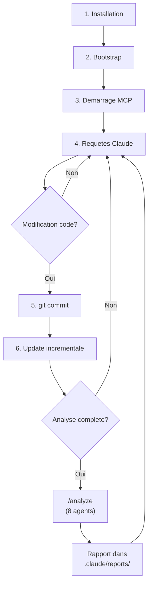

# Guide Lineaire

> Du debut a la fin : Executer un flow complet avec AgentDB

---

## Prerequis

Avant de commencer, assurez-vous d'avoir :

| Prerequis | Version | Verification |
|-----------|---------|--------------|
| Python | >= 3.10 | `python --version` |
| pip | Latest | `pip --version` |
| Universal Ctags | >= 6.0 | `ctags --version` |
| Git | >= 2.0 | `git --version` |
| Claude Code CLI | Latest | `claude --version` |

---

## Etape 1 : Structure Initiale

### 1.1 Verifier la Structure du Projet

```bash
# Verifier que .claude existe
ls -la .claude/

# Structure attendue :
.claude/
├── agentdb/         # Bibliotheque core
├── mcp/             # Serveur MCP
├── scripts/         # Bootstrap & Update
├── tests/           # Tests
├── config/          # Configuration YAML
├── logs/            # Logs (cree automatiquement)
└── settings.json    # Config MCP
```

### 1.2 Verifier la Configuration

```bash
# Verifier settings.json
cat .claude/settings.json
```

Sortie attendue :

```json
{
  "mcpServers": {
    "agentdb": {
      "command": "python",
      "args": ["-m", "mcp.agentdb.server"],
      "cwd": "${workspaceFolder}/.claude",
      "env": {
        "AGENTDB_PATH": "${workspaceFolder}/.claude/agentdb/db.sqlite",
        "AGENTDB_LOG_LEVEL": "INFO"
      }
    }
  }
}
```

---

## Etape 2 : Bootstrap de la Base

### 2.1 Lancer le Bootstrap

```bash
cd /chemin/vers/projet
python .claude/scripts/bootstrap.py
```

### 2.2 Suivre la Progression

Le script affiche une barre de progression pour chaque etape :

```
AgentDB Bootstrap v2.0
=======================

[1/9] Creating directory structure...
      Created: .claude/agentdb/
      Created: .claude/logs/
      [OK]

[2/9] Initializing SQL schema...
      Executing schema.sql (11 tables, 24 indexes)
      [OK]

[3/9] Scanning project files...
      Found: 150 files to index
      Excluded: 45 files (node_modules, .git, etc.)
      [OK]

[4/9] Indexing symbols and relations...
      [=====================================] 150/150 files
      Indexed: 1,245 symbols
      Created: 3,421 relations
      [OK]

[5/9] Calculating metrics...
      Lines of code: 45,000
      Average complexity: 4.2
      [OK]

[6/9] Analyzing Git activity...
      Commits analyzed: 500
      Contributors found: 8
      [OK]

[7/9] Marking critical files...
      Critical files: 15
      Security-sensitive: 8
      [OK]

[8/9] Importing default patterns...
      Imported: 12 patterns
      Categories: error_handling, memory_safety, security
      [OK]

[9/9] Verifying database integrity...
      PRAGMA integrity_check: OK
      PRAGMA foreign_key_check: OK
      [OK]

Bootstrap completed in 45.2 seconds
Database: .claude/agentdb/db.sqlite (2.5 MB)
```

### 2.3 Verifier la Base Creee

```bash
# Verifier que la base existe
ls -lh .claude/agentdb/db.sqlite

# Statistiques rapides avec sqlite3
sqlite3 .claude/agentdb/db.sqlite "
  SELECT 'Files:', COUNT(*) FROM files
  UNION ALL
  SELECT 'Symbols:', COUNT(*) FROM symbols
  UNION ALL
  SELECT 'Relations:', COUNT(*) FROM relations
  UNION ALL
  SELECT 'Patterns:', COUNT(*) FROM patterns;
"
```

Sortie :

```
Files:|150
Symbols:|1245
Relations:|3421
Patterns:|12
```

---

## Etape 3 : Demarrer le Serveur MCP

### 3.1 Demarrage Automatique (Recommande)

Le serveur MCP demarre automatiquement avec Claude Code :

```bash
# Depuis la racine du projet
claude
```

Claude Code lit `settings.json` et lance le serveur AgentDB.

### 3.2 Demarrage Manuel (Debug)

Pour tester le serveur manuellement :

```bash
cd .claude
AGENTDB_PATH="$(pwd)/agentdb/db.sqlite" \
AGENTDB_LOG_LEVEL="DEBUG" \
python -m mcp.agentdb.server
```

### 3.3 Verifier les Logs

```bash
# Logs en temps reel
tail -f .claude/logs/agentdb.log
```

Exemple de log :

```
2024-01-15 10:30:00 - agentdb.server - INFO - MCP Server starting on stdio
2024-01-15 10:30:00 - agentdb.server - INFO - Database connected: db.sqlite
2024-01-15 10:30:01 - agentdb.tools - INFO - Tool call: get_file_context
2024-01-15 10:30:01 - agentdb.queries - INFO - Query completed in 15ms
```

---

## Etape 4 : Premiere Requete

### 4.1 Dans Claude Code

Une fois Claude Code lance, vous pouvez poser des questions :

```
Utilisateur: Analyse le fichier src/drivers/lcd.c
```

Claude utilise automatiquement l'outil MCP :

```
Claude: Je vais recuperer le contexte de ce fichier.

[Appel MCP: get_file_context("src/drivers/lcd.c")]

Le fichier src/drivers/lcd.c contient :
- 10 fonctions (lcd_init, lcd_write, ...)
- Complexite moyenne: 4.2
- Marque comme critique (driver hardware)
- 1 bug historique (buffer overflow, resolu)
- Pattern applicable: driver_error_handling

Je note que la fonction lcd_write a une complexite de 12,
ce qui depasse le seuil "medium" de 10. Elle pourrait
beneficier d'un refactoring.
```

### 4.2 Exemples de Questions

| Question | Outil MCP Utilise |
|----------|-------------------|
| "Qui appelle lcd_init ?" | `get_symbol_callers` |
| "Si je modifie lcd.h, quel impact ?" | `get_file_impact` |
| "Y a-t-il eu des bugs dans ce module ?" | `get_error_history` |
| "Quels patterns dois-je suivre ici ?" | `get_patterns` |
| "Trouve toutes les fonctions gpio_*" | `search_symbols` |
| "Resume-moi le module drivers" | `get_module_summary` |

---

## Etape 5 : Mise a Jour Apres Commit

### 5.1 Workflow Normal

```bash
# Apres avoir modifie du code
git add .
git commit -m "Fix buffer overflow in lcd_write"

# Mettre a jour la base
python .claude/scripts/update.py
```

### 5.2 Sortie du Script Update

```
AgentDB Incremental Update
===========================

Detecting changes...
  Modified: 2 files
  Added: 1 file
  Deleted: 0 files

Updating files...
  [1/3] src/drivers/lcd.c
        - Removed 12 old symbols
        - Indexed 12 new symbols
        - Updated 28 relations
  [2/3] src/drivers/lcd.h
        - No symbol changes
        - Updated file hash
  [3/3] src/tests/test_lcd.c (new)
        - Indexed 5 symbols
        - Created 8 relations

Updating Git activity...
  - Refreshed commit counts
  - Updated contributors

Update completed in 2.3 seconds (target: <5s)
```

### 5.3 Automatisation avec Git Hook

Creez `.git/hooks/post-commit` :

```bash
#!/bin/bash
echo "Updating AgentDB..."
python .claude/scripts/update.py 2>&1 | head -5
```

Rendez-le executable :

```bash
chmod +x .git/hooks/post-commit
```

---

## Etape 5.5 : Lancer une Analyse Complete avec /analyze

### La Commande /analyze

La commande `/analyze` orchestre les 8 agents en 4 phases :

```bash
# Depuis Claude Code
/analyze
```

### Variables de Contexte Git

Le script `main.py` calcule automatiquement le contexte Git :

| Variable | Description | Exemple |
|----------|-------------|---------|
| `$BRANCH_NAME` | Branche actuelle | `feature/auth` |
| `$PARENT_BRANCH` | Branche parente | `main` |
| `$FROM_COMMIT` | Base du diff (merge-base) | `abc123` |
| `$TO_COMMIT` | HEAD | `def456` |
| `$FILES_LIST` | Fichiers modifies | `src/auth.py, src/login.py` |
| `$FILES_COUNT` | Nombre de fichiers | `2` |

### Deroulement de l'Analyse

```
Phase 0: Initialisation
  ├─ Nettoyer logs (.claude/logs/agentdb_queries.log)
  └─ AgentDB bootstrap --incremental

Phase 1: Analyse Parallele (3 agents)
  ├─ ANALYZER : Impact des modifications
  ├─ SECURITY : Vulnerabilites et CWEs
  └─ REVIEWER : Qualite et conventions

Phase 2: RISK puis Enrichissement
  ├─ RISK : Score de risque (attend Phase 1)
  │
  └─ Puis en parallele :
      ├─ SYNTHESIS : Fusionne les 4 agents
      └─ SONAR : Enrichit SonarQube (si disponible)

Phase 3: Consolidation
  └─ META-SYNTHESIS : Fusion + deduplication

Phase 4: Publication
  └─ WEB-SYNTHESIZER : JSON pour site web

Resultat : .claude/reports/{date}-{commit}/
  ├─ REPORT.md
  ├─ analyzer.md, security.md, reviewer.md, risk.md
  ├─ meta-synthesis.json
  └─ web-report.json
```

### Exemple de Sortie

```
╔═══════════════════════════════════════════════════════════════╗
║                                                               ║
║     VERDICT: 🟠 CAREFUL - Review approfondie requise          ║
║                                                               ║
║     SCORE GLOBAL: 62/100                                      ║
║                                                               ║
║     3 issues bloquantes detectees                             ║
║     Temps de correction estime : ~45 minutes                  ║
║                                                               ║
╚═══════════════════════════════════════════════════════════════╝
```

---

## Etape 6 : Cas d'Usage Avance

### 6.1 Analyse d'Impact Avant Refactoring

```
Utilisateur: Je veux refactorer la fonction spi_transfer.
             Quel serait l'impact ?
```

Claude :

```
[Appel MCP: get_symbol_callers("spi_transfer", max_depth=5)]

La fonction spi_transfer est appelee par :

Niveau 1 (direct) :
  - lcd_write() dans src/drivers/lcd.c:102
  - flash_read() dans src/drivers/flash.c:45
  - flash_write() dans src/drivers/flash.c:78

Niveau 2 :
  - display_refresh() appelle lcd_write
  - config_load() appelle flash_read

Niveau 3 :
  - main_loop() appelle display_refresh
  - boot_init() appelle config_load

Resume de l'impact :
  - 6 fonctions affectees
  - 4 fichiers impactes
  - 1 fichier critique (main.c)

Recommandation : Creer une PR avec tests de regression
pour lcd et flash avant le refactoring.
```

### 6.2 Detection de Regression

```
Utilisateur: La fonction crypto_encrypt a-t-elle deja eu
             des problemes ?
```

Claude :

```
[Appel MCP: get_error_history(symbol_name="crypto_encrypt",
                              severity="high")]

Oui, 2 incidents historiques :

1. [CRITIQUE] Padding Oracle Attack (2023-06)
   - CWE-649
   - Resolution: Passage a AES-GCM
   - Commit fix: a1b2c3d

2. [HIGH] Weak Key Generation (2023-09)
   - CWE-330
   - Resolution: Utilisation de /dev/urandom
   - Ticket: SEC-456

Attention : crypto_encrypt est dans un chemin critique
et marque security_sensitive. Tout changement doit
passer par une revue de securite.
```

### 6.3 Conformite Architecturale

```
Utilisateur: Ce code respecte-t-il nos decisions
             d'architecture ?
```

Claude :

```
[Appel MCP: get_architecture_decisions(file_path="src/app/network.c")]

ADRs applicables a ce fichier :

ADR-005: No Blocking Calls in Main Thread
  Status: accepted
  Decision: All network calls must be async

ADR-012: TLS 1.3 Minimum
  Status: accepted
  Decision: Reject connections < TLS 1.3

Je detecte dans votre code une utilisation de
connect() synchrone ligne 45. Cela viole ADR-005.

Suggestion : Utilisez connect_async() du module
network_utils.
```

---

## Etape 7 : Depannage

### 7.1 Problemes Courants

| Symptome | Cause Probable | Solution |
|----------|----------------|----------|
| "Database not found" | Bootstrap non execute | `python .claude/scripts/bootstrap.py` |
| "Symbol not found" | Index obsolete | `python .claude/scripts/update.py` |
| Requetes lentes | Cache SQLite froid | Premiere requete normale |
| "ctags not found" | ctags non installe | `apt install universal-ctags` |

### 7.2 Reinitialisation Complete

```bash
# Supprimer la base existante
rm -f .claude/agentdb/db.sqlite
rm -f .claude/agentdb/db.sqlite-wal
rm -f .claude/agentdb/db.sqlite-shm

# Relancer le bootstrap
python .claude/scripts/bootstrap.py
```

### 7.3 Verification d'Integrite

```bash
sqlite3 .claude/agentdb/db.sqlite "PRAGMA integrity_check;"
# Doit retourner: ok

sqlite3 .claude/agentdb/db.sqlite "PRAGMA foreign_key_check;"
# Doit etre vide (pas d'erreurs)
```

---

## Etape 8 : Bonnes Pratiques

### 8.1 Frequence de Mise a Jour

| Scenario | Frequence |
|----------|-----------|
| Developpement actif | Apres chaque commit (hook) |
| Revue de code | Avant la revue |
| CI/CD | A chaque merge dans main |

### 8.2 Optimisation des Requetes

- Utilisez `max_depth=2` par defaut pour les callers/callees
- Filtrez par `module` quand possible
- Utilisez `limit` pour les grandes recherches

### 8.3 Maintenance

```bash
# Hebdomadaire : Vacuum de la base
sqlite3 .claude/agentdb/db.sqlite "VACUUM;"

# Mensuel : Analyse des statistiques
sqlite3 .claude/agentdb/db.sqlite "ANALYZE;"
```

---

## Resume du Flow Complet



### Les 8 Agents et leurs Roles

| Phase | Agent | Role |
|-------|-------|------|
| 1 | analyzer | Calcule l'impact des modifications |
| 1 | security | Detecte les vulnerabilites (CWEs) |
| 1 | reviewer | Verifie qualite et conventions |
| 1 | risk | Score de risque global |
| 2 | synthesis | Fusionne les 4 agents Phase 1 |
| 2 | sonar | Enrichit les issues SonarQube |
| 3 | meta-synthesis | Consolidation et deduplication |
| 4 | web-synthesizer | JSON pour site web CRE |

---

## Prochaine Etape

Continuez vers [06-maintenance-et-tests.md](./06-maintenance-et-tests.md) pour comprendre la suite de tests et les procedures de maintenance.
